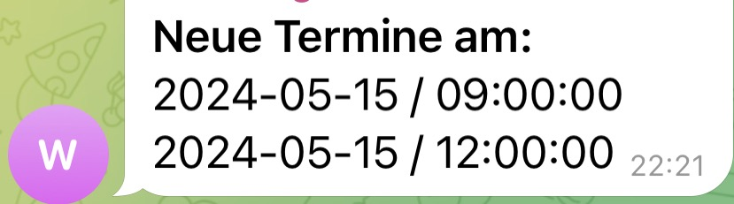

# Simply Book It Slot Finder

[](https://opensource.org/licenses/ISC)
[](https://nodejs.org)
[](https://www.typescriptlang.org/)

Automated slot finder for SimplyBook.it booking systems with Telegram notifications. This tool monitors booking availability and sends real-time notifications when slots become available.

## Features

✨ **Automated Monitoring** - Continuously checks for available booking slots
🔔 **Telegram Notifications** - Instant notifications via Telegram when slots are found
⏰ **Flexible Scheduling** - Configurable check intervals using cron expressions
🐳 **Docker Support** - Ready-to-deploy Docker container
🔒 **Production Ready** - Proper error handling, logging, and configuration validation
📊 **TypeScript** - Fully typed codebase for better maintainability

## Table of Contents

- [Prerequisites](#prerequisites)
- [Installation](#installation)
- [Configuration](#configuration)
- [Usage](#usage)
  - [Local Development](#local-development)
  - [Production Deployment](#production-deployment)
  - [Docker Deployment](#docker-deployment)
- [Environment Variables](#environment-variables)
- [Project Structure](#project-structure)
- [Development](#development)
- [Troubleshooting](#troubleshooting)
- [Contributing](#contributing)
- [License](#license)

## Prerequisites

- **Node.js** >= 18.0.0
- **npm** >= 9.0.0
- **Docker** (optional, for containerized deployment)
- **Telegram Bot** (for notifications)

## Installation

### 1. Clone the Repository

```bash
git clone https://github.com/yourusername/simply-book-it-slot-finder.git
cd simply-book-it-slot-finder
```

### 2. Install Dependencies

```bash
npm install
```

### 3. Configure Environment Variables

Copy the example environment file and configure it:

```bash
cp .env.example .env
```

Edit `.env` with your actual values (see [Configuration](#configuration) section).

## Configuration

### Setting up Telegram Bot

1. **Create a Telegram Bot**:
   - Open Telegram and search for [@BotFather](https://t.me/BotFather)
   - Send `/newbot` command
   - Follow the instructions to create your bot
   - Save the bot token provided

2. **Get Your Chat ID**:
   - Send a message to your newly created bot
   - Visit: `https://api.telegram.org/bot<YOUR_BOT_TOKEN>/getUpdates`
   - Look for the `"chat":{"id":` field in the response
   - Save this chat ID

### Finding Provider and Service IDs

To find the correct Provider and Service IDs for your booking system:

1. Open your SimplyBook.it booking page in a browser
2. Open Developer Tools (F12)
3. Go to the Network tab
4. Navigate through the booking process
5. Look for API calls to `/v2/booking/time-slots/`
6. Check the request parameters for `provider` and `service` values

## Usage

### Local Development

Run the application in development mode (executes immediately for testing):

```bash
npm run start:dev
```

Or build and run:

```bash
npm run build
npm start
```

### Production Deployment

For production deployment, set `NODE_ENV=PRODUCTION` in your `.env` file. The application will run on the configured schedule.

```bash
npm run build
npm start
```

The application will start checking for slots according to the configured schedule.

### Docker Deployment

#### Using Docker Compose (Recommended)

1. **Build and start the container**:

```bash
docker-compose up -d
```

2. **View logs**:

```bash
docker-compose logs -f slot-finder
```

3. **Stop the container**:

```bash
docker-compose down
```

#### Using Docker Directly

1. **Build the image**:

```bash
docker build -t simply-book-it-slot-finder .
```

2. **Run the container**:

```bash
docker run -d \
  --name slot-finder \
  --env-file .env \
  simply-book-it-slot-finder
```

3. **View logs**:

```bash
docker logs -f slot-finder
```

4. **Stop and remove the container**:

```bash
docker stop slot-finder
docker rm slot-finder
```

## Environment Variables

| Variable | Required | Default | Description |
|----------|----------|---------|-------------|
| `BOOKITHOST` | ✅ Yes | - | SimplyBook.it URL to monitor (e.g., `https://yourcompany.simplybook.it`) |
| `TELEGRAM_TOKEN` | ⚠️ Recommended | - | Telegram bot token from @BotFather |
| `TELEGRAM_CHATID` | ⚠️ Recommended | - | Telegram chat ID for notifications |
| `NODE_ENV` | No | `development` | Application mode: `development` or `PRODUCTION` |
| `SCHEDULE` | No | `*/30 * * * *` | Cron expression for check interval (every 30 minutes) |
| `DAYSAHEAD` | No | `28` | Number of days ahead to check (1-365) |
| `PROVIDER` | No | `2` | Provider ID from booking system |
| `SERVICE` | No | `2` | Service ID from booking system |
| `DATES_IGNORE` | No | - | Comma-separated dates to ignore in YYYY-MM-DD format (e.g., `2024-12-25,2024-12-31`) |

### Schedule Examples

The `SCHEDULE` variable uses cron syntax:

- `*/15 * * * *` - Every 15 minutes
- `*/30 * * * *` - Every 30 minutes (default)
- `0 * * * *` - Every hour
- `0 */2 * * *` - Every 2 hours
- `0 9-17 * * 1-5` - Every hour from 9 AM to 5 PM, Monday to Friday
- `0 9,12,15,18 * * *` - At 9 AM, 12 PM, 3 PM, and 6 PM

## Project Structure

```
simply-book-it-slot-finder/
├── src/
│   ├── services/
│   │   ├── bookingService.ts      # SimplyBook.it API integration
│   │   └── notificationService.ts # Telegram notification service
│   ├── config.ts                  # Configuration and validation
│   ├── types.ts                   # TypeScript type definitions
│   └── index.ts                   # Application entry point
├── build/                         # Compiled JavaScript (generated)
├── images/                        # Documentation images
├── .env.example                   # Example environment configuration
├── .dockerignore                  # Docker ignore patterns
├── .gitignore                     # Git ignore patterns
├── docker-compose.yml             # Docker Compose configuration
├── Dockerfile                     # Docker image definition
├── nodemon.json                   # Nodemon configuration
├── package.json                   # Node.js dependencies and scripts
├── tsconfig.json                  # TypeScript configuration
└── README.md                      # This file
```

## Development

### Available Scripts

- `npm run build` - Compile TypeScript to JavaScript
- `npm start` - Build and run the application
- `npm run start:dev` - Run in development mode with auto-reload
- `npm run docker:build` - Build Docker image
- `npm run docker:run` - Run Docker container

### Code Quality

The project uses:
- **TypeScript** for type safety
- **Strict mode** enabled for better code quality
- **ESLint** ready configuration
- **Modular architecture** for maintainability

### Adding New Features

1. Create feature branch: `git checkout -b feature/your-feature`
2. Make changes and test thoroughly
3. Update documentation as needed
4. Submit pull request

## Troubleshooting

### Common Issues

**Issue: "Missing required environment variable: BOOKITHOST"**
- Ensure `.env` file exists and contains `BOOKITHOST`
- Verify the URL format is correct (include `https://`)

**Issue: Telegram notifications not working**
- Verify `TELEGRAM_TOKEN` and `TELEGRAM_CHATID` are correct
- Test by sending a message to your bot first
- Check bot permissions in the chat

**Issue: No slots found but they exist**
- Verify `PROVIDER` and `SERVICE` IDs are correct
- Check `DAYSAHEAD` value is appropriate
- Monitor network requests in browser to confirm API parameters

**Issue: Docker container exits immediately**
- Check logs: `docker logs slot-finder`
- Verify environment variables are properly set
- Ensure `.env` file exists and is readable

### Debugging

Enable detailed logging:

```bash
NODE_ENV=development npm run start:dev
```

Check Docker container logs:

```bash
docker-compose logs -f
```

## Example Notification

When a slot is found, you'll receive a Telegram notification like this:



## Contributing

Contributions are welcome! Please feel free to submit a Pull Request.

1. Fork the repository
2. Create your feature branch (`git checkout -b feature/AmazingFeature`)
3. Commit your changes (`git commit -m 'Add some AmazingFeature'`)
4. Push to the branch (`git push origin feature/AmazingFeature`)
5. Open a Pull Request

## License

This project is licensed under the ISC License - see the [LICENSE](LICENSE) file for details.

## Acknowledgments

- Built with [Node.js](https://nodejs.org/)
- [Telegram Bot API](https://core.telegram.org/bots/api) for notifications
- [node-cron](https://github.com/node-cron/node-cron) for scheduling
- [Axios](https://axios-http.com/) for HTTP requests

## Support

If you encounter any issues or have questions:

1. Check the [Troubleshooting](#troubleshooting) section
2. Review existing [GitHub Issues](https://github.com/yourusername/simply-book-it-slot-finder/issues)
3. Create a new issue with detailed information
